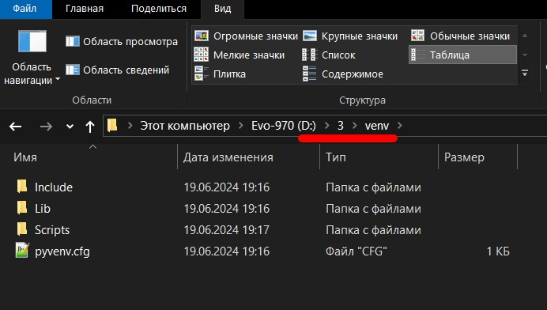

# Установка интерфейса командной строки "Comfy" 
Существует интерфейс управлени ComfyUI в режиме "командной строки Comfy", с которым мы сейчас м познакомимся.

Все примеру тут приведены исходя из того, что питон у нас находится по пути **"c:\p311"** (весрия 3.11), а устанавливать **Comfy** мы будем в папку **"d:\3"**.

Для начала создадим "виртуальное окружение" питона "venv" *(но можно и просто в любого питона, это не принципиально, т.к. все команды я буду давать в универсальной нотации, и они подойдут как для системного, так и для venv и портабельного питона)*:

    c:\p311\python -m venv d:\3\venv
	

Если мы все правильно сделали, то у нас по адресу "d:\3"появится папка "venv" со следующим содержимым:

  

Запомним, что вызывать питона из этой установки нам надо командой:

    d:\3\venv\Scripts\python

... и все обращения к питону мы будем производить именно этой командой, с указанием полного путит к нему.

>Примечание:
>Если у вас питон стоит по другому адресу, то замените просто путь "d:\3\venv\Scripts\" на свой.
>Я пишу тут полные пути для того, чтобы можно было повторить эти команды, просто копируя их из со страницы.

  

Итак, у нас утановлен "чистый" питон, без всяких пакетов. Новая идеология установки Comfy заключается в следующием:

<b>Устанавливаем "Comfy-Cli" - инструмент командной строки для ComfyUI</b>

    d:\3\venv\Scripts\python -m pip install comfy-cli
	
Питон немного повозится, и установит нужные пакеты питона и новые компоненты.

  

Пошаманим немного, и выполним такую команду:

    d:\3\venv\Scripts\Comfy

... и получим справку по управлению Comfy из режима командной строки. Запросим номер версии (см.фото)

  

Теперь управление Comfy можно производить отсюда.

Выполняем команды:

    d:\3\venv\Scripts\comfy install
	
... и начнется установка ComfyUI в папку "Документы\comfy\ComfyUI" (%DocumentsFolder%\comfy\ComfyUI) текущего пользователя.
	
Меня это не совсем устраивает, мне не нравится место, куда он мне "задвинул" комфи, поэтому я делаю так:

    xcopy /V /D /S /E /H c:\Users\ИМЯ_АККАУНТА\Documents\comfy\ComfyUI d:\3\ComfyUI\
	rd /s /q  c:\Users\ИМЯ_АККАУНТА\Documents\comfy\ComfyUI
	
Это переместит все, что установилось в папку "d:\3" где у нас уже находится папка "venv".

>Примечание:
>Перемещение не обязательно, если вы хотите, то можете продолжать работать и так, этоя делаю для того, чтобы было понятно, как можно изменить место расположения комфи.

После того, как мы переместили комфи, дадим следующую команду:

    d:\3\venv\Scripts\comfy set-default d:\3\ComfyUI

  

Эта команда установит указанную нами папку с комфи на "папка по умолчанию".

>Примечание:
>В качестве "Default ComfyUI workspace" выбирать уже существующую на диске ComfyUI, если она скачана с git...
>Надо установить "pip install comfy" в питона уже существующей ComfyUI, потом командой "comfy set-default path" где path - путь к существующему ComfyUI, то получим интерфейс команндой строки для управления, запуска, обновления, установки пакетов, нод, модулей и т.п. через интерфейс командной строки.

Выполним команду:

    d:\3\venv\Scripts\comfy env

... и получим окно с текущими настройками Comfy.

  

Следующая команда запускает ComfyUI:

    d:\3\venv\Scripts\comfy launch
	

  

	
Запускаем браузер:

    http://127.0.0.1:8188
	
... и видим знакомый интерфейс:

  

Понятно, что "первый блин комом", это мой первый запуск системы таким образом... много непоняток.

И все же она словила "птичку Обломинго" не сумев САМА на чистом питоне (!) нормально поставить все пакеты питона (((

  

# Установка comfy_cli "на дурачка"

Собственно говоря, весь "путь" от установки самого "comfy_cli" и до запуска ComfyUI можно пройти следующими командами, только первая из которых "в питоне" и устанавливает в питона сам пакет "comfy_cli"^

    \venv\Scripts\python -m pip install comfy_cli

Дальше мы уже не имеем дело с самим питоном, а все управление Comfy производится EXE-шником с именем "comfy.exe", который инсталлируется в папку скриптов (если это venv), вызывается оттуда и ему
 в качестве аргументов дается указание что именно сделать *(в примере ниже "Установить ComfyUI по умолчанию")*:

    \venv\Scripts\comfy install

И дальше уже можно запустить только что установленный ComfyUI *(в примере с аргуметом автозапуска браузера)*:

    \venv\Scripts\comfy launch — —auto-launch
	
Собственно и все, что нужно для установки и запуска ComfyUI )))	

Оригинал документации: https://github.com/Comfy-Org/comfy-cli